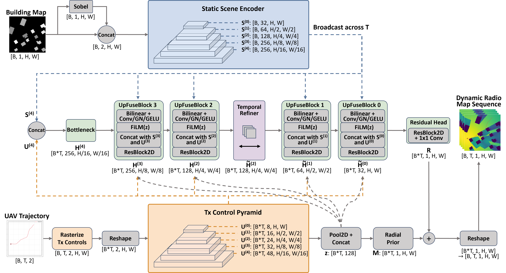
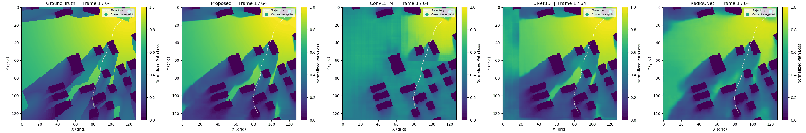

# UAV Trajectory-Conditioned Dynamic Radio Map Construction via Sequence Generation Models

This repository contains the PyTorch implementation for **"UAV Trajectory-Conditioned Dynamic Radio Map Construction via Sequence Generation Models"**. The project trains sequence generation models to construct dynamic radio maps conditioned on UAV trajectories and building layouts.

## Project Structure

```text
DynamicRadioMap/
+-- Models/                      # Proposed model and baseline architectures
|   +-- Proposed.py
|   +-- baselines.py
|   +-- RadioUNet.py
+-- Utils/                       # Dataloaders, trainers, metrics helpers, GIF utilities
|   +-- build_dataloader.py
|   +-- build_dataloader_RadioUNet.py
|   +-- trainer.py
|   +-- trainer_RadioUNet.py
+-- Checkpoints/                 # Example or pretrained model checkpoints
+-- Figures/                     # Architecture figures and dynamic radio map demos
+-- train_Proposed.py            # Train the proposed sequence generation model
+-- train_ConvLSTM.py            # Train ConvLSTM baseline
+-- train_Full3DUNet.py          # Train 3D U-Net baseline
+-- train_RadioUNet.py           # Train RadioUNet baseline
+-- compute_metrics.py           # Evaluate reconstruction metrics
+-- compute_interpolation_metrics.py
+-- compare_efficiency.py
+-- visualize.py
```

## Model Architecture

Replace or update the image below with the final architecture diagram used in the paper.



## Dynamic Radio Map Example

The following GIF template can be used to present the generated dynamic radio map sequence.



## Dataset Template

The dataset and trained model weights can be downloaded from: [Dataset & Weights Download Link](https://connectpolyu-my.sharepoint.com/:u:/g/personal/23045503r_connect_polyu_hk/IQA9omw_6lAwS6y-PyF897U1AW39DGc0ykQtO63cMEv2NNk?e=Lsb1Dv). (Password: `PolyU`)

The dataloader expects the dataset root to follow this structure:

```text
DynamicRadioMapDataset/
+-- buildings/
|   +-- 0_0.npy
|   +-- 0_1.npy
|   +-- ...
+-- raw_radio_maps/
|   +-- 0_0_0.npy
|   +-- 0_0_1.npy
|   +-- ...
+-- trajs_array.npy
```

Expected naming format:

- `buildings/{tile_idx}_{subtile_idx}.npy`: building height map.
- `raw_radio_maps/{tile_idx}_{subtile_idx}_{traj_idx}.npy`: dynamic radio map sequence.
- `trajs_array.npy`: UAV trajectory array indexed by tile, subtile, and trajectory.

Default scripts assume 5 tiles, 64 subtiles per tile, and 30 trajectories per building layout. Adjust the dataloader arguments if your dataset uses different counts.

## Training Example

Install the required Python packages, including `torch`, `numpy`, `matplotlib`, `scikit-image`, and `tqdm`, then run training from the repository root:

```bash
python train_Proposed.py \
  --data_root /path/to/DynamicRadioMapDataset \
  --out_dir Results/ \
  --device cuda:0 \
  --epochs 200 \
  --batch_size 4 \
  --num_frames 64
```

The training script saves logs, curves, and checkpoints under the output directory.

## Evaluation

After training, evaluate reconstruction quality with:

```bash
python compute_metrics.py --dataset_dir /path/to/DynamicRadioMapDataset --device cuda:0
```

Additional scripts are provided for interpolation metrics, efficiency comparison, and visualization.

## Citation

If this repository is useful for your research, please cite the corresponding paper:

```bibtex
@article{your_citation_key,
  title={UAV Trajectory-Conditioned Dynamic Radio Map Construction via Sequence Generation Models},
  author={},
  journal={},
  year={}
}
```
